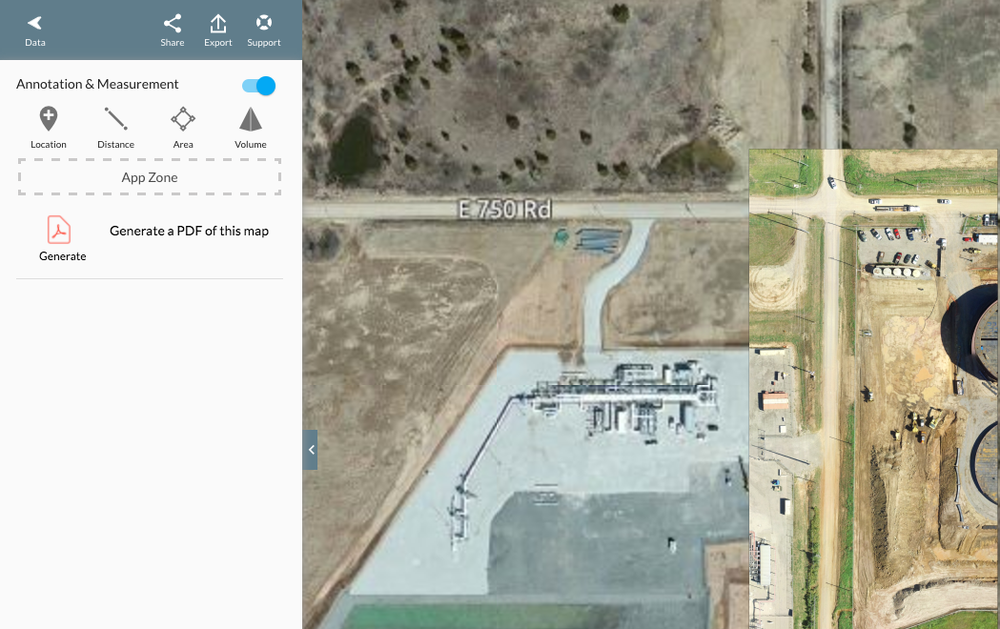

# DroneDeploy PDF Generator

Screenshot:


##  Utilizing the Drone Deploy API to retrieve map tile information and generate PDF with map tiles
  This application works in the `Annotation & Measurement` section in a project. It will collect the Map tiles images and store them into a PDF format file and automatically download it for the user.

### Development process

1. Initial thoughts

  After reading the project spec, my initial thoughts were to make a React component for the app. I considered building a class to abstract the business logic. After simply browsing through the `hello world sample project` provided by DroneDeploy, I decided that it was an unnecessary complication to instantiate an object.

2. Reading Docs

  Then I went to the DroneDeploy developer docs to get myself familiar with the API. I found the `Tile` section and it's associated example highly resembles to the core logic of my app. So I made the decision to use the example as a foundation to my app and start to make further implementation on top of it.

3. View implementation

  I followed the `Design Guidelines` and the example on `DroneDeploy UI Kit` and made the view inside a container. Since a lot of the default styles are provided in the stylesheet, I was able to implement the view of the app easily without unnecessary styling. I tried to find the PDF icon online but eventually decided to just crop the icon from the given example.

4. Interacting with the API

  When trying out the example:

  ```javascript
  function fetchTileDataFromPlan(api, plan){
    return api.Tiles.get({planId: plan.id, layerName: layer.value, zoom: parseInt(zoom.value)});
  }
  ```

  I found out that the `fetchTileDataFromPlan` function threw an error about the `undefined api`. After spending a long time trying to pass the original API I defined in the previous promise, I decided to get around it by defining a global variable which stores the API.

  I created the `downloadPDF()` function as a entry point connecting the onclick handler from the view and will invoke the `updateTile()` function to retrieve tile information.

  Then I ran into a problem that when getting the Tile information, the server responded with `403` Error. Because I did not know that in order to test the application, I need to create my own `Construction Example` in order to gain the access to the tiles. After searching online, I was able to find the solution posted on [DroneDeploy Forum](http://forum.dronedeploy.com/t/403-forbidden-error-on-get-request-to-tiles/4995).

5. Third-party library: jsPDF

  In order to create and download the tile image in a PDF format, I found a third-party library [jsPDF](https://github.com/MrRio/jsPDF) which can help me to achieve this.

  I was able to create and download the PDF file with no problem. However, adding images to the PDF requires an additional step which converts the regular image to `DataURL Base64` format.

  However, the several ways using `HTML Canvas` or `FileReader` all failed to convert the images to DataURL due to `No 'Access-Control-Allow-Origin' header` and the request was `blocked` by chrome.

  An alternative solution will be building a server to convert the image url to base64 url. The server code is [here](https://github.com/lianwangtao/Dronedeploy-dataUrl). However the `node-base64-image` library did not convert to the correct dataUrl. Another converting method is `Buffer()` but it didn't yield the correct output either.  
